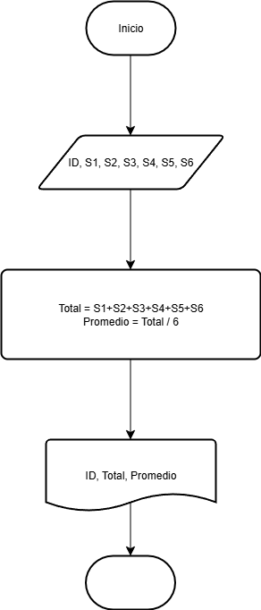

# Ejercicio 1
graficos que se utilizan para representar algoritmos diagrama 


# Ejercicios 2
Construye un algoritmo que, al recibir como datos el ID del empleado y los seis primeros sueldos del año, calcule el ingreso total semestral y el promedio mensual, e imprima el ID del empleado, el ingreso total y el promedio mensual.

## Solucion
```
Inicio
Leer ID, S1, S2, S3, S4, S5, S6
Total = S1 + S2 + S3 + S4 + S5 + S6
Promedio = Total / 6
Escribir ID, Total, Promedio
Fin
```

### Diagrama de flujo

