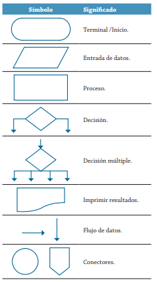

# Ejercicio 1
graficos que se utilizan para representar algoritmos diagrama 


# Ejercicios 2
Construye un algoritmo que, al recibir como datos el ID del empleado y los seis primeros sueldos del año, calcule el ingreso total semestral y el promedio mensual, e imprima el ID del empleado, el ingreso total y el promedio mensual.

## Solucion
```
Inicio
Leer ID, S1, S2, S3, S4, S5, S6
Total = S1 + S2 + S3 + S4 + S5 + S6
Promedio = Total / 6
Escribir ID, Total, Promedio
Fin
```

### Diagrama de flujo


# Ejercicio 3
```
Inicio
Leer N1, N2, N3, N4, N5, N6
Total = N1 + N2 + N3 + N4 + N5 + N6
Promedio = Total / 6
Nota Actual = Promedio * 0.7
Nota necesaria = (3.0 - Nota actual) / 0.3
Escribir Total, Promedio, Nota actual, Nota necesaria
Fin
```
## Diagrama de flujo


# Ejercicios
## Ejercicio 3
Realice un algoritmo para determinar cuánto se debe pagar por equis cantidad de lápices considerando que si son 1000 o más el costo es de $85 cada uno; de lo contrario, el precio es de $90. Represéntelo con el pseudocódigo y el diagrama de flujo.

|Variables| Tipo| Comentario|
|---------|----|----------|
|Lapices | Entrada| Cantidad de lapices|
|Precio | Salida| Precio total de los lapices|
|85, 90 | Constantes| no cambian|

### Pseudocodigo
```

Inicio
Leer lapices
si lapices >= 1000:
       valor_unidad = 85
Si no
    valor_unidad = 90
Fin si
Precio = Lapices * valor_unidad
Escribir "El valor total es:", Precio
Fin

```

### Diagrama de flujo


## Ejercicio 4
Un almacén de ropa tiene una promoción: por compras superiores a $250 000 se les aplicará un descuento de 15%, de caso contrario, sólo se aplicará un 8% de descuento. Realice un algoritmo para determinar el precio final que debe pagar una persona por comprar en dicho almacén y de cuánto es el descuento que obtendrá. Represéntelo mediante el pseudocódigo y el diagrama de flujo.

|Variables| Tipo| Comentario|
|---------|-----|-----------|
|Total_compra| Entrada| Valor de la compra|
|Descuento| Salida| Descuento segun el valor de compra|
|Precio_final| Salida| Valor a pagar|
|15%, 8%, $250000| Constantes| Descuentos y valor limite|

### Pseudocodigo

```
Inicio
Leer total_compra
Si total_compra > 250000
    descuento = total_compra * 0.15
Si no
    descuento = total_compra * 0.8
Fin si
precio_final = total_compra - descuento
Escribir "valor a pagar", precio_final
Fin
```

## Ejercicio 5
El director de una escuela está organizando un viaje de estudios, y requiere determinar cuánto debe cobrar a cada alumno y cuánto debe pagar a la compañía de viajes por el servicio. La forma de cobrar es la siguiente: si son 100 alumnos o más, el costo por cada alumno es de $65.00; de 50 a 99 alumnos, el costo es de $70.00, de 30 a 49, de $95.00, y si son menos de 30, el costo de la renta del autobús es de $4000.00, sin importar el número de alumnos.

|Variables| Tipo| Comentario|
|---------|-----|-----------|
|Alumnos| Entrada| Cantidad de alumnos|
|Costo_alumno| Salida| Precio por alumno|
|Costo_total| Salida| Costo total del viaje|
|#alumnos>=100, 99>=#alumnos>=50, 49>=#alumnos>=30, 30>#alumnos| Constantes| Descuentos segun el rango de alumnos|

### pseudocodigo
```
Inicio
Leer #alumnos
Si #alumnos >= 100
    Costo_alumno = 65
Si no
    Si 99>=#alumnos>=50
        Costo_alumno = 70
    Si no
        Si 49>=#alumnos>=30
            Costo_alumno = 95
        Si no
            Costo_total = 4000
            Costo_alumno = Costo_total/#alumno
        Fin si
        Costo_total = Costo_alumno * #alumno
    Fin si
    Costo_total = Costo_alumno * #alumno
Fin si
Costo_total = Costo_alumno * #alumno
Escribir Costo_total, Costo_alumno
Fin
```
