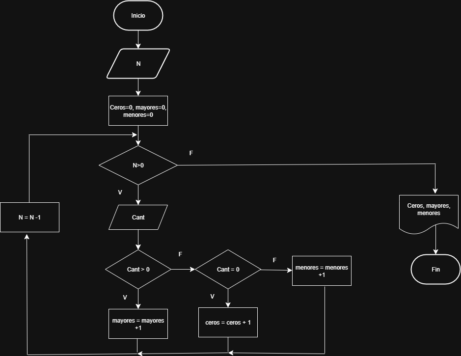

# Ejercicio de bucles

## Ejercicio 2
Se requiere un algoritmo para determinar, de N cantidades, cuantas son cero, Cuantas son menores a cero, y cuantas son mayores a cero
Realice el diagrama de flujo y el pseudocodigo representarlo, utilizando el ciclo apropiado
|Variables| Tipo|
|---------|----|
|N|Entrada|
|Cant|Entrada|
|Ceros|Salida|
|Mayores|Salida|
|Menores|Salida|
### Pseudocodigo
```
Inicio
Leer N 
Ceros=0, Mayores=0, Menores=0
Mientras N>0
    Leer Cant
    Si Cant>0
        Mayores=Mayores+1
    Si no
        Si cant=0
            Ceros=Ceros+1
        Si no 
            Menores=Menores+1
        Fin si
    Fin si
    N=N-1
Fin mientras
Escribir Ceros, Mayores, Menores
Fin
```

### Diagrama de flujo

         