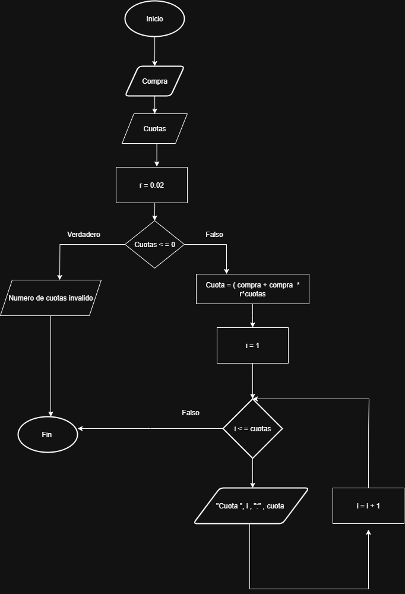

# Ejercicio de bucles

## Ejercicio 2
Se requiere un algoritmo para determinar, de N cantidades, cuantas son cero, Cuantas son menores a cero, y cuantas son mayores a cero
Realice el diagrama de flujo y el pseudocodigo representarlo, utilizando el ciclo apropiado
|Variables| Tipo|
|---------|----|
|N|Entrada|
|Cant|Entrada|
|Ceros|Salida|
|Mayores|Salida|
|Menores|Salida|
### Pseudocodigo
```
Inicio
Leer N 
Ceros=0, Mayores=0, Menores=0
Mientras N>0
    Leer Cant
    Si Cant>0
        Mayores=Mayores+1
    Si no
        Si cant=0
            Ceros=Ceros+1
        Si no 
            Menores=Menores+1
        Fin si
    Fin si
    N=N-1
Fin mientras
Escribir Ceros, Mayores, Menores
Fin
```

### Diagrama de flujo

         
## Ejercicio 3
Calcular el factorial de un numero entero ingresado por el usuario
|Variables| Tipo|
|---------|----|
<<<<<<< HEAD
|N|Entrada
|Resultado|Salida|
=======
|N|Entrada|
|Resultado|Salida|

### Pseudocodigo
```
Inicio
Leer N
Factorial = 1
Mientras N>0
    Si N>0
       Factorial = factorial * N
       N=N-1
     Fin mientras
    Si no
      Imprimir Factorial
Fin
```

### Diagrama de flujo


## Ejercicio 4
Consultar cómo funcionan las tarjetas de crédito. Asumir una tasa de interés fija (2%). Preguntar al usuario el valor de la compra y el número de cuotas. Calcular y mostrar en pantalla. El valor de cada una de las cuotas que debe pagar hasta saldar la deuda. 

### Pseudocodigo
```
Inicio
leer compra
    leer cuotas
    r = 0.02

    si cuotas <= 0 entonces
        escribir "numero de cuotas invalido"
    sino
        cuota = (compra + compra*r*cuotas) / cuotas

        i = 1
        mientras i <= cuotas hacer
            escribir "cuota ", i, ": ", cuota
            i = i + 1
        fin mientras
    fin si
fin
```
### Diagrama de flujo


>>>>>>> 1392af18383cda43054013a43f59fcf390dead5e
